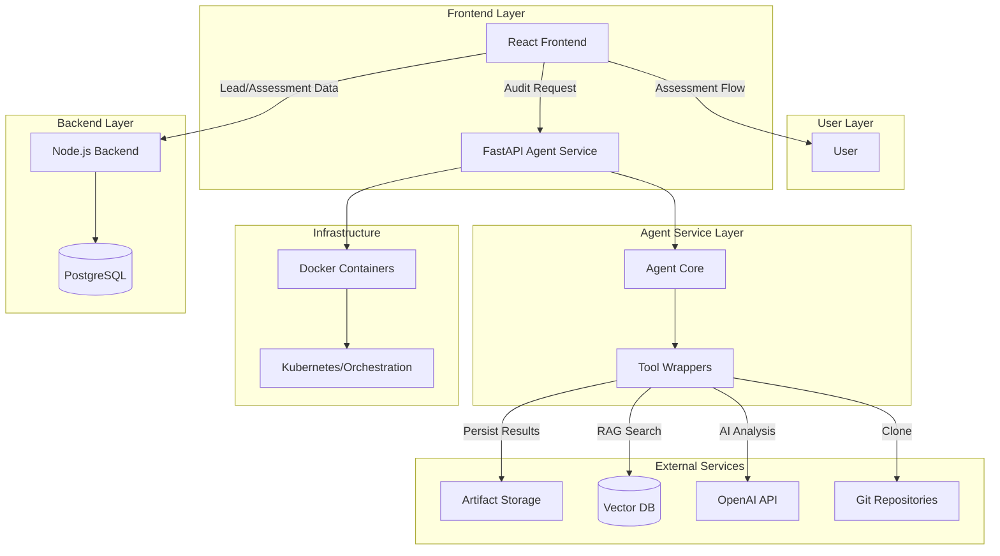
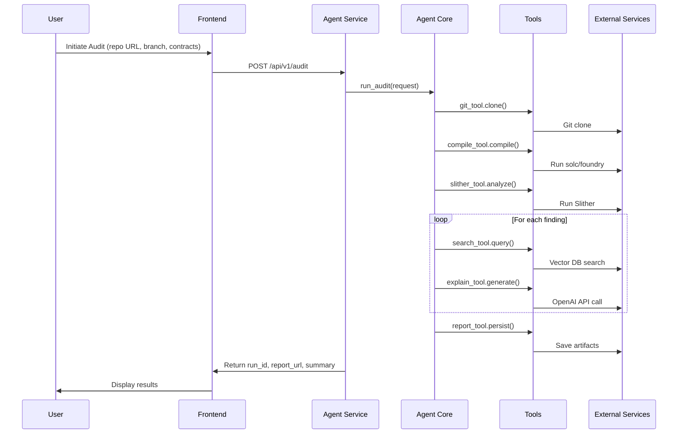
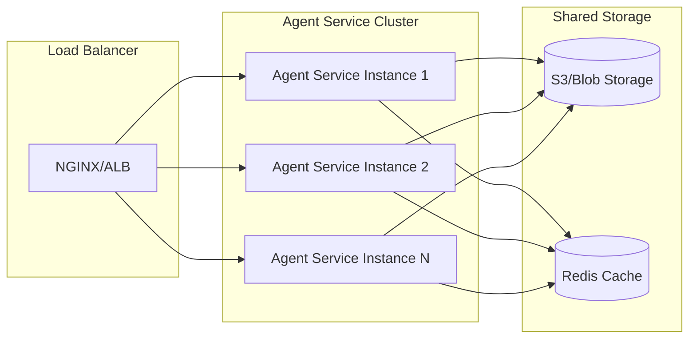

# CosmoAudit OpenAI Agent SDK Integration Architecture Design

## Overview

This document outlines the architecture for integrating the OpenAI Agent SDK into CosmoAudit, enabling AI-powered smart contract security audits. The design adds a new Python-based microservice while maintaining the existing React frontend and Node.js backend architecture.

## Existing Architecture

CosmoAudit currently consists of:
- **Frontend**: React application with TypeScript, handling lead capture, security assessments, and co-creator program
- **Backend**: Node.js/Express server with PostgreSQL database for storing leads, assessments, and payment data
- **Infrastructure**: Containerized deployment with Railway, supporting payment integration via Razorpay

## New Components

### Agent Service (Python/FastAPI)
A dedicated microservice for AI-powered audit execution:
- **FastAPI Application**: RESTful API exposing audit endpoints
- **Agent Core**: Orchestrates the audit workflow using OpenAI Agent SDK
- **Tool Wrappers**: Pure functions for git operations, compilation, analysis, and reporting
- **Containerization**: Docker-based deployment for portability and scaling

### Tool Components
1. **git_tool**: Clones target repositories
2. **compile_tool**: Compiles Solidity contracts using solc or foundry
3. **slither_tool**: Runs Slither static analysis
4. **search_tool**: Queries vector database for similar past findings
5. **explain_tool**: Uses OpenAI Agent SDK for AI-powered explanations and remediation
6. **report_tool**: Persists results and generates reports

## Architecture Diagram

## Data Flow

### Audit Execution Flow

## Integration Points

### Frontend Integration
- Add "Request AI Audit" functionality to assessment results page
- New component for audit input form (repo URL, branch, contract paths)
- Display audit results with findings, explanations, and remediation suggestions
- Handle async audit processing with progress indicators

### Backend Integration
- Optional: Extend PostgreSQL schema to store audit metadata
- Proxy audit requests through Node.js backend for unified authentication
- Link audit results to existing leads/assessments

### Agent Service Integration
- Standalone microservice accessible via REST API
- Environment-based configuration for API keys and endpoints
- Artifact storage integration (local filesystem or cloud storage)

## Security Considerations

### API Security
- **Authentication**: API key-based authentication for agent service endpoints
- **Authorization**: Rate limiting per user/IP to prevent abuse
- **HTTPS**: All communications encrypted in transit
- **Input Validation**: Sanitize repository URLs and file paths

### Data Protection
- **PII Redaction**: Strip personal information from logs and artifacts
- **Secret Handling**: Never log API keys, private keys, or sensitive contract data
- **Artifact Security**: Encrypt stored audit artifacts and control access
- **Compliance**: GDPR/CCPA compliance for data handling and retention

### LLM Security
- **Prompt Engineering**: Structured prompts to prevent jailbreak attempts
- **Output Filtering**: Validate and sanitize AI-generated content
- **Usage Monitoring**: Track API usage and detect anomalous patterns
- **Fallback Handling**: Graceful degradation if OpenAI API unavailable

## Scalability & Deployment

### Containerization Strategy
- **Docker**: Multi-stage builds for minimal image size
- **Resource Limits**: CPU/memory constraints to prevent resource exhaustion
- **Health Checks**: Readiness and liveness probes for orchestration

### Scaling Considerations
- **Horizontal Scaling**: Stateless service supports multiple instances
- **Async Processing**: Use background jobs for long-running audits (>30s)
- **Caching**: Cache compiled contracts and RAG results where appropriate
- **Load Balancing**: Distribute requests across service instances

### Deployment Architecture

### Monitoring & Observability
- **Metrics**: Response times, success rates, resource usage
- **Logging**: Structured logs with correlation IDs
- **Tracing**: Distributed tracing for complex audit workflows
- **Alerts**: Automated alerts for failures or performance degradation

## Production Readiness Checklist

- [ ] Environment configuration management (secrets, configs)
- [ ] CI/CD pipeline with automated testing
- [ ] Monitoring and alerting setup
- [ ] Backup and disaster recovery procedures
- [ ] Performance benchmarking and optimization
- [ ] Security audit and penetration testing
- [ ] Documentation for operations and maintenance

## Migration Strategy

1. **Phase 1**: Deploy agent service alongside existing infrastructure
2. **Phase 2**: Integrate audit functionality into frontend
3. **Phase 3**: A/B test audit feature with subset of users
4. **Phase 4**: Full rollout with monitoring and optimization
5. **Phase 5**: Iterate based on user feedback and performance data

This architecture ensures the OpenAI Agent SDK integration is secure, scalable, and seamlessly integrated with the existing CosmoAudit platform while maintaining production-grade reliability and performance.